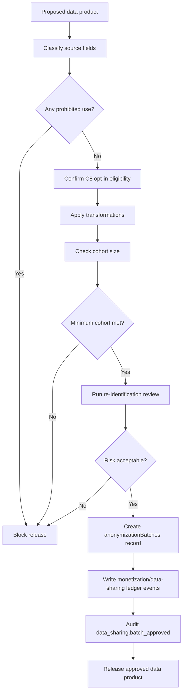

# Anonymization and Data-Sharing Lifecycle

This lifecycle defines how URAI approves, generates, audits, and releases anonymized data-sharing products.

## Required Records

- `anonymizationBatches`
- `monetizationLedger`
- `dataAccessLogs`
- `consentEvents` / `userConsent` for C8 eligibility

## Required Controls

- C8 consent required for participation
- Minimum cohort size of 100 unless stricter threshold applies
- Re-identification review required
- Raw biometric, raw transcript, raw image, and user-linked sensitive records prohibited
- Opt-out stops future inclusion
- Data product must document fields, transformations, cohort size, and approval owner

## Failure Modes

- Missing C8 consent: exclude user or block product
- Cohort below threshold: block release
- Re-identification risk too high: suppress/generalize or block
- Prohibited data class or use: block release
