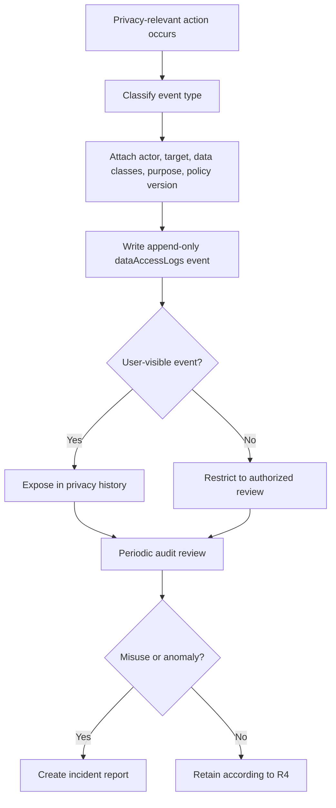

# Audit Lifecycle

This lifecycle defines how URAI records, protects, reviews, and exposes privacy-relevant audit events.

## Required Records

- `dataAccessLogs`
- `incidentReports` when misuse or anomaly is detected
- `privacyRequests` where user-visible rights activity occurred

## Required Audit Events

- Consent changes
- Export requests and downloads
- Deletion requests and failures
- Admin access to user data
- Automated access to L3-L6 data
- Biometric enrollment and deletion
- Anonymized data product approval
- Incident creation and closure

## Required Controls

- Append-only log behavior
- Actor identity and actor type
- Target user where applicable
- Data classes involved
- Purpose and policy version
- Reviewable outcome
- Access restriction for internal-only audit logs

## Failure Modes

- Missing audit event: block release for sensitive features
- Unknown actor: mark failed and investigate
- Admin access without purpose: create incident
- Audit tampering: critical incident
