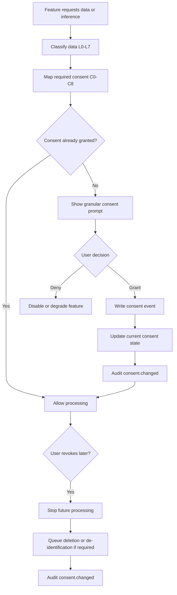

# Consent Lifecycle

This lifecycle defines how URAI consent is presented, recorded, enforced, revoked, and audited.

## Required Records

- `userConsent`
- `consentEvents`
- `dataAccessLogs`
- dependent `deletionJobs` when revocation invalidates stored data

## Required Controls

- Granular consent per tier
- No bundled consent for C4, C5, C6, or C8
- Revocation for non-essential consent
- Consent event evidence hash
- Policy version attached to every consent event

## Failure Modes

- Missing consent tier: block feature
- Revoked consent: stop future processing
- Unknown policy version: block feature until migrated
- Consent prompt unavailable: feature must degrade gracefully
