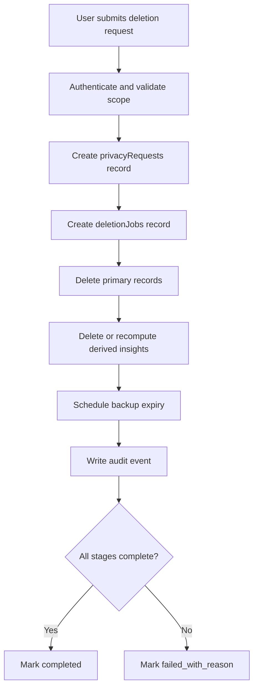

# Deletion Lifecycle

This lifecycle defines how URAI handles record, category, date-range, biometric-only, and account deletion.

## Required Records

- `privacyRequests`
- `deletionJobs`
- `dataAccessLogs`

## Required Controls

- Deletion scope must be explicit.
- L3-L5 data requires deletion support.
- Biometric-only deletion must be supported where L5 is processed.
- Derived data must be deleted or recomputed without deleted source data.
- Backup expiry must be documented.

## Required Deletion Stages

1. `requested`
2. `validated`
3. `queued`
4. `primary_store_deleted`
5. `derived_records_deleted_or_recomputed`
6. `backup_expiry_scheduled`
7. `completed`
8. `failed_with_reason`

## Failure Modes

- Unknown user: reject with safe error
- Invalid scope: request clarification
- Legal hold: document and narrow scope
- Derived data failure: mark failed and retry
- Backup expiry unknown: block launch readiness
