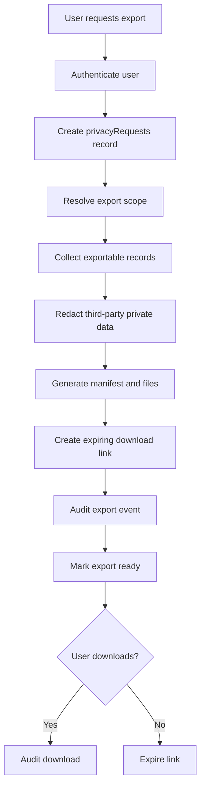

# Export Lifecycle

This lifecycle defines how URAI handles authenticated user data export and portability requests.

## Required Records

- `privacyRequests`
- `exportJobs`
- `dataAccessLogs`

## Required Export Contents

- Account data
- Consent history
- Stored memories and timeline records
- Transcripts and user-approved content
- User-facing derived insights
- Explanation metadata where available
- Data-sharing participation and ledger events where applicable
- Privacy request history

## Required Controls

- Authentication required
- Step-up authentication for sensitive exports where appropriate
- Expiring download links
- Integrity manifest
- Redaction for third-party private data
- Audit trail for request, generation, download, expiry, and failure

## Failure Modes

- Authentication failure: deny export
- Redaction uncertainty: require review
- Manifest generation failure: mark failed with reason
- Expired link: require new export request
