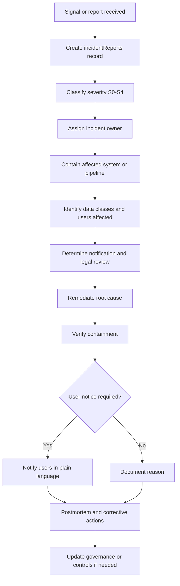

# Incident Response Lifecycle

This lifecycle defines how URAI detects, classifies, contains, remediates, notifies, and learns from privacy incidents.

## Required Records

- `incidentReports`
- `dataAccessLogs`
- related `privacyRequests`, `deletionJobs`, `exportJobs`, or `anonymizationBatches` where applicable

## Severity Levels

- S0: Near miss
- S1: Low
- S2: Moderate
- S3: High
- S4: Critical

## Required Controls

- Incident owner assigned
- Affected data classes identified
- User impact estimated
- Containment actions documented
- Notification decision documented
- Root cause documented
- Corrective actions assigned
- Postmortem required for S2+

## Failure Modes

- Unknown severity: default to higher severity until reviewed
- Sensitive or biometric exposure: treat as S3 or S4
- Uncontained issue: pause dependent processing
- Repeated incident pattern: update governance and release gates
