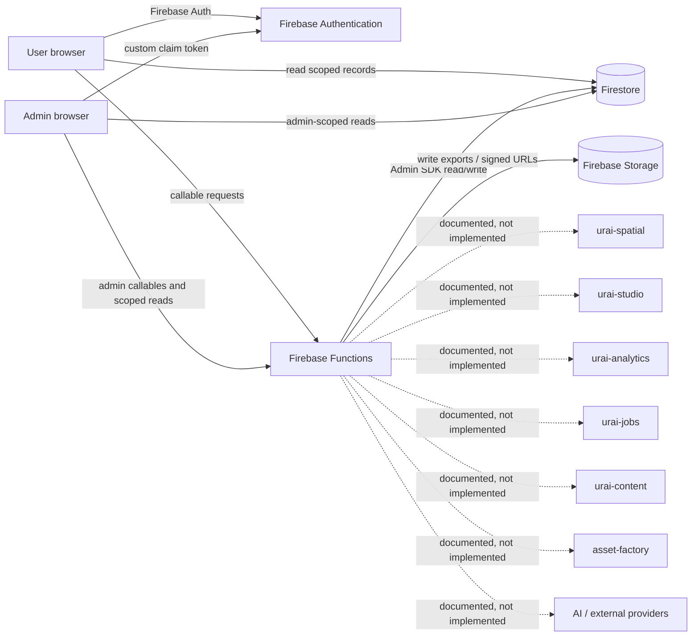

# URAI Privacy Principal Engineering, Security, and Completion Audit

**Repository:** `LifeLoggerAI/urai-privacy`  
**Canonical branch audited:** `main`  
**Audited main SHA:** `b81d5a189aeb1bf233dce0dd539e7aa7d387b36a`  
**Audit remediation branch:** `audit/privacy-authz-p0-2026-07-06`  
**Draft remediation PR:** `#82`  
**Audit date:** 2026-07-06  
**Review type:** technical privacy/security/product/operations review; not legal advice

---

## 1. Executive truth summary

`urai-privacy` is a real hybrid Next.js/Firebase privacy-control application and governance repository. It is not docs-only. It contains:

- public trust-center routes;
- an authenticated user privacy center;
- administrator routes;
- Firebase Auth integration;
- callable Firebase Functions for export, deletion, consent, audit, and health workflows;
- Firestore and Storage rules;
- local and emulator-backed test scaffolding;
- CI/release scripts;
- privacy standards, policy templates, schemas, and cross-repository adoption documents.

What is genuinely operational in source:

- authenticated creation of local export requests;
- administrator processing of local export jobs;
- JSON export packages and short-lived signed download URLs;
- authenticated account-level deletion request creation;
- a local Firestore deletion executor with dry-run, legal-hold checks, retained evidence, and audit events;
- consent-state and consent-event recording for five hard-coded purposes;
- user/admin-scoped reads for privacy records;
- public/user/admin route surfaces;
- Firebase deployment configuration and release scripts.

What remains prototype-level or incomplete:

- consent is recorded but not enforced before processing;
- revocation is not propagated to other URAI systems;
- deletion covers only a fixed set of Firestore collections and the user document;
- export covers only fixed local collections and caps queries at 1,000 records;
- retention is a hard-coded display/template model, not an execution engine;
- policy, OpenAPI, and JSON-schema contracts describe operations that the runtime does not implement;
- authenticated production proof is a manually supplied JSON evidence artifact, not an independently executing live test suite;
- cross-system integration is a documentation matrix, not a deployed privacy gateway, SDK, event bus, or orchestration system;
- provider, device, mobile, location, sensor, and XR governance are standards/intent rather than runtime enforcement;
- encryption/key-management claims are not backed by repository-owned cryptographic enforcement;
- monitoring, rollback, backup restore, incident routing, and production authority are not proven.

**Production-readiness verdict:** **NOT PRODUCTION-READY as the privacy authority for the full URAI ecosystem.** A narrow public trust-center site may be deployable after content review, but the repository cannot truthfully be called a complete production privacy control plane until the authorization defects, consent enforcement, complete export/deletion, retention execution, cross-system integration, and live operational proof are resolved.

Largest risks:

1. **Critical administrator privilege escalation on audited `main`:** user-owned profile documents can carry the same `role=admin` value trusted by Firestore rules and callable Functions.
2. **Critical privacy-workflow mutation bypass on audited `main`:** direct client writes can bypass callable audit/event creation.
3. **High destructive-deletion approval defect:** the dry-run hash includes a changing timestamp and is optional at execution.
4. **High false-completeness risk:** deletion/export/policy contracts overstate actual runtime coverage.
5. **High consent gap:** consent state does not block data collection, inference, provider calls, or downstream processing.
6. **High public-surface gap:** global metadata indexes all routes; no route-tree-level admin gate/noindex boundary existed on audited `main`.

Highest-value next actions:

- validate and merge PR `#82` only after all CI/emulator checks pass;
- implement issue `#83` consent decision/enforcement;
- implement issue `#84` complete deletion orchestration;
- implement issue `#85` complete cross-system export;
- implement issue `#86` retention execution;
- implement issue `#87` contract/version/claim alignment;
- complete existing issue `#59` with real staging and authenticated proof.

---

## 2. Repository evidence card

| Field | Evidence-backed status |
|---|---|
| Repository | `LifeLoggerAI/urai-privacy` |
| Visibility | Public |
| Default branch | `main` |
| Audited main SHA | `b81d5a189aeb1bf233dce0dd539e7aa7d387b36a` |
| Latest audited commit | `docs: record deploy attempt in lock status` |
| Package version | `0.2.0-staging-scaffold` in `package.json` |
| Governance version | `0.1.0-draft` in `VERSION.md` |
| API/schema version | `0.1.0-draft` |
| Version alignment | Inconsistent; tracked in issue `#87` |
| Runtime | Node `>=20.19.0`; Firebase Functions Node 20 |
| Framework | Next.js 16, React 18, TypeScript 5.9, Firebase 12/13 |
| Package manager | npm with root and Functions lockfiles |
| Primary hosting model | Firebase App Hosting/framework backend plus Firestore, Storage, Functions |
| Database | Firestore |
| Object storage | Firebase Storage / Google Cloud Storage bucket |
| Authentication | Firebase Auth; UI uses Google popup provider |
| Current open PRs at audit start | 0 |
| Draft PR opened during audit | `#82` |
| Open issues at audit close | `#59`, `#74`, `#83`–`#87` |
| Tags/releases | Not verifiable through available connector operations; repository files do not provide a coherent released-version record |
| Main workflow/status proof | No status/check evidence surfaced for audited main SHA through the connector |
| PR validation | CI initiated on PR `#82`; initial static-rules failure was repaired; final all-green proof still required |
| Build result | Source/build scripts exist; current PR build must be confirmed by CI before merge |
| Test result | Unit/typecheck/lint passed in an early PR run; full release/emulator chain remains the merge gate |
| Deployment evidence | `PRODUCTION_LOCK_STATUS.json` says deployment not confirmed; live public host could not be independently verified in this audit environment |
| Runtime evidence | No authenticated live workflow evidence independently executed during this audit |
| Unresolved blockers | authorization patch review, consent enforcement, complete deletion/export, retention engine, cross-system adoption, live staging proof, monitoring/rollback, legal/content approval |

Repository permissions available to the audit operator included pull, push, triage, maintain, and admin. No destructive action, merge, release, or deploy was performed.

---

## 3. Repository map

| Path | Purpose | Truth status |
|---|---|---|
| `app/` | Next.js public, privacy-center, and admin routes | Functional UI; mixed live/static behavior |
| `components/` | Shared navigation/auth/session UI | Functional; Firebase-client dependent |
| `firebase/` | Browser Firebase initialization | Functional when environment variables are present |
| `functions/` | Firebase callable backend | Functional local control-plane subset |
| `src/lib/` | Types, in-memory workflow helpers, Firebase client wrappers | Mixed: runtime wrappers plus test/demo-like pure helpers |
| `firestore.rules` | Client authorization/data-boundary rules | Critical defects on audited main; hardened in PR `#82` |
| `storage.rules` | Export/evidence access boundaries | Functional owner/admin read model; hardened claim parity in PR `#82` |
| `firestore.indexes.json` | Firestore indexes | Present; production deployment proof absent |
| `api/` | Draft OpenAPI contract | Documentation-only and broader than runtime |
| `schemas/` | Draft machine-readable privacy schema | Documentation/design contract; not runtime parity |
| `docs/` | Governance, readiness, audits, release gates, integration matrices | Substantial; some statements overstate implementation |
| `legal/` | Legal templates/notices | Templates only; not legal approval |
| `policy/` | Policy artifacts | Draft/governance content |
| `scripts/` | Verification, smoke, release, evidence, security, QA | Mixed strength; several are presence/schema checks rather than behavioral proof |
| `tests/unit/` | Pure workflow/helper tests | Useful but not sufficient for runtime security |
| `tests/integration/` | Integration-named tests | Predominantly in-memory helper coverage; emulator suite required for real boundaries |
| `tests/rules/` | Firebase rules-unit-testing coverage | Important; patch expands security regressions |
| `.github/workflows/` | Multiple CI/release workflows | Active but duplicated; required-check enforcement not verified |
| `release-evidence/` and `launch-proof/` | Redacted evidence templates/receipts | Evidence framework; live proof not independently established |
| `website/`, `examples/`, `tools/` | Legacy/static/governance utilities | Secondary/legacy surfaces; must not be treated as runtime authority |

---

## 4. Current architecture and trust boundaries

### Plain-language architecture truth

- The runtime is a **single Next.js application plus a Firebase backend**, not a mature distributed privacy platform.
- Browser clients authenticate with Firebase and call named callable Functions.
- Firestore and Storage rules constrain direct client access; server Admin SDK calls bypass those rules by design.
- Export and deletion are synchronous administrator-triggered callables, not durable queue-based orchestrators.
- No repository-owned queue, event bus, worker lease, retry ledger, dead-letter queue, service registry, or downstream adapter framework exists.
- Cross-system privacy authority is currently expressed as documentation and required behavior, not as enforceable contracts deployed across URAI repositories.

### Trust boundaries

1. Unauthenticated internet to public Next.js routes.
2. Browser session to Firebase Auth token.
3. Firebase Auth claims to admin authorization.
4. Client SDK to Firestore/Storage rules.
5. Callable Functions to Firebase Admin SDK.
6. Functions to Storage signed URLs.
7. Future URAI services/providers—currently undocumented runtime trust boundaries.
8. CI/release operator to Firebase deployment authority.

---

## 5. Route, API, worker, command, and library inventory

### 5.1 Verified route inventory

| Route | Purpose | Auth/authorization | Storage effects | Sensitive data | Status | Tests/risks |
|---|---|---|---|---|---|---|
| `/` | Public trust-center entry | Public | None | None expected | Functional public page | Metadata/public copy only |
| `/privacy` | Public privacy promise/policy surface | Public | None | None expected | Functional; claims broader than runtime | Claim-to-code mismatch |
| `/passport` | Public permissions/identity explanation | Public | None | None expected | Public informational surface | Runtime identity/permission orchestration not implemented here |
| `/data-controls` | Public export/delete/consent explanation | Public | None | None expected | Informational | Not itself a control engine |
| `/consent` | Public consent principles | Public | None | None expected | Informational | Must not be confused with live consent center |
| `/delete-export` | Public navigation/intake explanation | Public | Potentially links to privacy center | Privacy-rights intent | Informational/bridge | Verify no duplicate intake path |
| `/responsible-ai` | Public responsible-AI framing | Public | None | None expected | Informational | No provider governance runtime |
| `/safety` | Public safety boundaries | Public | None | None expected | None expected | Informational | Content/legal review required |
| `/what-urai-does-not-do` | Public non-claims/boundaries | Public | None | None expected | Informational | Content/legal review required |
| `/privacy-center` | User privacy dashboard shell | Intended signed-in subflows | Reads local records through child routes | User privacy records | Mixed | Noindex boundary added in PR `#82` |
| `/privacy-center/export` | Create export request; retrieve completed package | Firebase Auth; owner scope | Creates request/job; gets signed URL | User export package | Functional but incomplete | Local-only, 1,000-record caps, no expiry worker |
| `/privacy-center/delete` | Create account deletion request; view status | Firebase Auth; owner scope | Creates deletion request | Account/privacy data | Functional intake only | Complete erasure not implemented |
| `/privacy-center/consent` | Grant/deny/revoke five purposes | Firebase Auth; owner | Writes via callable | Consent records/events | Functional ledger; no enforcement | Fixed purposes, hard-coded draft policy version |
| `/privacy-center/audit-log` | User-visible privacy activity | Firebase Auth; owner | Read only | Audit metadata | Functional local view | Audit coverage incomplete across ecosystem |
| `/privacy-center/retention` | Retention explanations | Publicly renderable under privacy-center tree | None | Policy metadata | UI-only/templates | No execution engine |
| `/admin` | Admin control-room summary | **Ungated on audited main**; route-tree gate added in PR `#82` | None | Static readiness data | Static shell | Was indexable and accessible |
| `/admin/privacy-requests` | Process exports/deletion; execute deletion | Child page AuthGate on main; route-tree gate in PR | Admin callables; scoped reads | User IDs, requests, plan hashes | Functional local admin UI | Must require custom claim and audit all mutations |
| `/admin/audit-log` | Read audit events | Page AuthGate | Read only | User/admin audit metadata | Functional local view | No pagination/query purpose capture |
| `/admin/retention` | Retention templates | Ungated on audited main; route-tree gate in PR | None | Policy template data | Static/UI-only | Not live policy state |
| `/admin/policies` | Draft policy version table | Ungated on audited main; route-tree gate in PR | None | Policy metadata | Static/UI-only | Hard-coded draft |

The route existence test on audited main checks files/default exports and placeholder text. It is not a browser E2E test. PR `#82` expands it to require protected-route noindex and admin route-tree gating.

### 5.2 Callable Function inventory

| Callable | Purpose | Auth | Authorization | Inputs | Outputs/effects | Status/risk |
|---|---|---|---|---|---|---|
| `createExportRequest` | Create export request/job | Required | Self | None | `privacyRequests`, `exportJobs`, audit | Functional local intake; no rate/idempotency guard |
| `processExportRequest` | Collect local records and create export files | Required | Admin | `jobId` | Firestore updates, two Storage JSON files, audit | Incomplete; fixed collections and 1,000 limits |
| `getExportDownloadUrl` | Create signed owner/admin URL | Required | Owner/admin | `jobId`, file type | 15-minute signed URL, audit | Functional local retrieval |
| `createDeletionRequest` | Create account-level deletion request | Required | Self | reason | `deletionRequests`, audit | Intake only; no identity reverification/cancel window |
| `processDeletionRequest` | Admin state transition/plan | Required | Admin | request/status | request state, user deletion marker, audit | Local workflow only |
| `executeDeletionRequest` | Dry-run or destructive local deletion | Required | Admin | request, mode, plan hash | fixed Firestore deletes, user doc delete, audit | High-risk; hash/authorization defects repaired in PR |
| `updateConsent` | Record consent state/event | Required | Self | purpose, tier, status | `consentRecords`, `consentEvents`, audit | Ledger only; no processing enforcement |
| `writeAuditLog` | Manual admin audit event | Required | Admin | action/target/request | `auditLogs` | Too permissive as a generic manual event; event vocabulary not enforced |
| `recordAdminAction` | Record admin action and audit event | Required | Admin | action/target/request/notes | `adminActions`, `auditLogs` | Functional local evidence |
| `getPrivacyHealthReport` | Count open local requests/policies/audits | Required | Admin | None | Read-only summary | Threshold-based sample; not system health/SLO proof |

### 5.3 Workers, schedules, webhooks, queues

- Scheduled retention worker: **missing**.
- Deletion queue/worker: **missing**; execution is synchronous callable work.
- Export queue/worker: **missing**; processing is synchronous callable work.
- Provider-deletion worker: **missing**.
- Webhooks: **none located**.
- Event consumer/producer contracts: **documentation-only**.
- Dead-letter queue: **missing**.
- Durable retry/idempotency ledger: **missing**.

### 5.4 Exported client/library surfaces

`src/lib/firebase-privacy-client.ts` exports:

- generic `callPrivacyFunction`;
- `createExportRequest`;
- `createDeletionRequest`;
- `updateConsentPreference`;
- `getExportDownloadUrl`;
- `executeDeletionRequest`;
- user/admin Firestore subscriptions.

No versioned external SDK package, generated OpenAPI client, service-to-service authorization library, policy-decision client, redaction library, provider registry client, or deletion/export adapter SDK exists.

### 5.5 Verification and release commands

| Command | What it actually proves | Audit status |
|---|---|---|
| `npm ci` | Deterministic root install | CI exercised |
| `npm ci --prefix functions` | Deterministic Functions install | CI exercised |
| `npm run lint` | Repository lint wrapper | Passed in initial PR run |
| `npm run typecheck` | Root TS compile check | Passed in initial PR run |
| `npm run test:unit` | Pure helper/static tests | Passed in initial PR run; not runtime authorization proof |
| `npm run test:rules:static` | String/presence checks over rules | Initially failed after hardening; validator repaired |
| `npm run test:e2e` | Route file/default-export checks | Misnamed; not browser E2E |
| `npm run audit:privacy` | Adoption document/file checks | Governance evidence, not runtime integration |
| `npm run audit:tier-one` | Presence/term/function checks | Presence-level proof |
| `npm run build` | Next production build | Required; current PR result must be confirmed |
| `npm --prefix functions run build/typecheck` | Functions TS build/typecheck | Required; current PR result must be confirmed |
| `npm run test:emulators` | Firebase Auth/Firestore/Storage/Functions emulator tests | Strongest local behavioral gate; current PR result required |
| `npm run security:gate` | secret patterns, deny-by-default strings, npm critical audit | Improved in PR; not SAST/DAST |
| `npm run test:smoke:live` | HTTP/HTML route reachability | Skips unless URL/strict env set; no auth workflow |
| `npm run test:live-auth-proof` | Schema-validates a supplied proof JSON | Does not execute workflows independently |
| `npm run final:production-lock` | Runs verifier with live/proof requirements enabled | Only as trustworthy as supplied live URL and proof artifact |

---

## 6. Capability matrix

| Capability | Actual status | Evidence and limitation |
|---|---|---|
| Explicit consent capture | Functional but incomplete | `updateConsent`; five hard-coded purposes |
| Informed consent presentation | UI-only/basic | Labels/tier only; no full purpose/provider/retention disclosure model |
| Consent versioning | Prototype | Hard-coded `0.1.0-draft` |
| Consent timestamps/receipts | Functional local record | Server timestamp plus hash; no portable/verifiable receipt format |
| Purpose-based consent | Partial | Purpose string accepted; no canonical registry enforcement |
| Per-data-type permissions | Missing | Tier/purpose model is not a data-field permission engine |
| Withdrawal | Functional recording only | Revoke state recorded; no downstream block/propagation |
| Consent renewal/expiry | Missing | Runtime status excludes expiry handling |
| Age/guardian/regional variants | Missing | Docs may discuss; no runtime paths located |
| Offline/cross-device consent sync | Partial | Firestore sync may occur online; explicit conflict/offline policy missing |
| Prevent processing before consent | Missing | No policy decision point or downstream guard |
| View my data | Partial | Local audit/request views; no complete data browser |
| Export my data | Functional but incomplete | Local fixed collections, 1,000 cap, no downstream contributors |
| Correct my data | Missing |
| Delete my data | Prototype/incomplete | Fixed Firestore records only |
| Restrict/object to processing | Missing |
| Analytics/model-improvement/location opt-outs | Consent labels only | No enforcing integrations |
| Revoke third-party access | Missing |
| Delete individual records/memories | Missing |
| Account deletion | Incomplete | Does not remove Firebase Auth account/sessions or all stores |
| Request tracking/status | Partial | Local request documents and UI |
| Identity verification for rights requests | Weak | Existing Firebase session only; no step-up/reverification |
| Admin review | Functional local UI | Authorization defect on main; patch in PR |
| Response deadlines/SLA | Documentation-only |
| Machine-readable export | Partial JSON/manifest | No ZIP/cross-system completeness |
| Downstream deletion propagation | Missing |
| Backup/archive deletion | Missing |
| Authentication | Functional Firebase Auth | Google popup shown; provider configuration proof absent |
| Session/token revocation | Missing from repo-owned workflows |
| MFA/passkeys/device registration | Missing |
| RBAC | Critically flawed on main; hardened in PR | No multi-role/least-privilege model beyond user/admin/system types |
| ABAC | Missing |
| Tenant isolation | Missing |
| Ownership checks | Partial UID rules | No cross-system ownership contract |
| Service authentication | Missing |
| Break-glass/impersonation/access reviews | Missing |
| Machine-readable data inventory | Draft schema/docs only | Runtime does not enforce all categories/processors/locations |
| Retention engine | Missing | Three hard-coded templates only |
| Legal hold | Functional local check | User-document hold field was owner-writable on main; hardened in PR |
| Deletion retries/tombstones/orphan detection | Missing |
| Encryption in transit/at rest | Platform assumption | No repo-owned proof/configuration inventory |
| Field/client/E2E encryption | Missing |
| Key management/rotation/user keys | Missing |
| Audit events | Functional local subset | No chained/WORM/signed ledger; incomplete ecosystem coverage |
| Tamper evidence | Prototype | Independent hashes are not immutable cryptographic proof |
| Provider inventory/governance | Documentation-only |
| Redaction/minimization before providers | Missing runtime |
| Provider deletion/training controls | Missing runtime |
| Location/sensor/XR privacy | Documentation-only/missing runtime |
| Public sharing/link controls | Missing |
| Family/delegate/legacy/emergency access | Missing |
| Cookies/analytics/telemetry | No SDKs located in audited source | Must be re-audited against deployed bundles/configuration |
| Policy/notice alignment | Mixed | Significant unsupported/forward-looking claims |

---

## 7. Privacy claim verification matrix

| Claim | Claim source | Enforcing code | Tests/runtime proof | Result |
|---|---|---|---|---|
| “Admin access must be claim/role-gated” | README/system matrix/UI | Main trusted claims **or owner-writable role docs** | Rules tests explicitly allowed role-doc admin | **Contradicted and critical on main**; fixed to trusted claims in PR `#82` |
| “No silent escalation” | README/public privacy page | Consent recording only | No downstream decision/enforcement tests | **Unsupported as a system claim** |
| “Export is operational” | README/UI | Local callable + Storage signed URL | Local/unit/emulator scaffolding; no live proof | **Partially true locally** |
| “Deletion is operational” | README/UI | Fixed local Firestore executor | Local helper/rules tests; no full-store proof | **Overstated for account/system deletion** |
| “Current-plan-hash guarded deletion” | README/admin UI | Hash included changing `generatedAt`; optional expected hash | Helper tests used length-based pseudo-hash | **Broken on main**; repaired in PR |
| “Append-only audit evidence” | README/rules | Client rule denies update/delete; Admin SDK can mutate | Rules tests only | **Partial; not immutable/tamper-evident** |
| “Retention policies” | README/UI/docs | Static arrays/docs | No scheduled cleanup tests | **Documentation/UI-only** |
| “Authenticated live proof” | README/release scripts | JSON artifact validator | Validator checks fields/status strings | **Evidence framework, not independent live execution** |
| “Cross-repo privacy authority” | README/system matrix | No shared SDK/gateway/events | Adoption scripts check files/terms | **Documentation-only** |
| “Explanation is a product surface” | Public privacy page/OpenAPI | No `/explain` runtime handler | None | **Unsupported** |
| “Scoped deletion” | OpenAPI/schema | Runtime account-only fixed scope | None | **Unsupported** |
| “Correction/restriction/opt-out” | Schema/OpenAPI/docs | No handlers/workflows | None | **Unsupported** |
| “Production repo-side complete” | `PRODUCTION_LOCK_STATUS.json` | N/A | Critical defects found in main | **Outdated/incorrect** |

---

## 8. Security findings

| ID | Severity | Title | Affected component | Evidence | Impact/exploitability | Remediation | Verification | Status |
|---|---|---|---|---|---|---|---|---|
| PRIV-001 | Critical | Owner-controlled administrator escalation | `firestore.rules`, `functions/src/index.ts`, `users/{uid}` | Main allows owner update and trusts user role doc | Authenticated user can set admin role and access/process other users' privacy records | Trust only server-issued Auth claims; protect privileged fields | Emulator cross-user tests and callable auth tests | Fixed in draft PR `#82`; CI required |
| PRIV-002 | Critical | Direct client mutation bypasses audited workflows | Firestore rules for requests/consent/audit/policy/legal hold | Main permits multiple owner/admin writes | Client can create/change privacy state without callable audit/event guarantees | Server-only writes; read-only scoped client rules | Emulator negative-write tests | Fixed in draft PR `#82`; compatibility review required |
| PRIV-003 | High | Deletion plan hash unstable and optional | deletion plan/executor | `generatedAt` included; `expectedPlanHash` optional | Dry-run approval cannot reliably bind execution; omission bypasses guard | Stable canonical hash; mandatory current hash | Unit/callable stale/missing hash tests | Fixed in draft PR `#82`; emulator/live proof required |
| PRIV-004 | High | Incomplete destructive deletion | Functions deletion executor | Deletes fixed Firestore collections and user doc only | User data remains in Auth, Storage, other repos/providers/backups | Durable adapter-based deletion orchestrator | End-to-end multi-store deletion tests | Open issue `#84` |
| PRIV-005 | High | Consent ledger does not enforce processing | Consent callable/UI | Writes state/events only | Processing/provider calls can proceed without consent or after revocation | Central policy decision API/SDK and revocation events | Deny-before-processing tests | Open issue `#83` |
| PRIV-006 | High | Export can silently omit data | Export collector | Fixed list; `.limit(1000)`; no contributors | Incomplete user-rights response reported as complete | Paginated contributor framework and completeness manifest | >1,000 and partial-failure tests | Open issue `#85` |
| PRIV-007 | High | Protected routes globally indexable and incomplete route-tree gating | `app/layout.tsx`; missing nested layouts on main | Global `index:true`; no admin layout | Admin/privacy route discovery and static admin pages exposed to indexing | Nested noindex metadata and route-tree AdminGate | Build metadata/static regression | Fixed in draft PR `#82` |
| PRIV-008 | High | Contract and marketing capability overstatement | OpenAPI/schema/README/public copy | Draft contracts exceed runtime | Users/integrators may rely on nonexistent controls | Claim-to-code gate and versioned contract | Contract parity tests | Open issue `#87` |
| PRIV-009 | High | No retention execution | retention pages/helpers/docs | Static templates only | Data may persist beyond stated windows | Scheduler, queue, legal-hold-aware cleanup, receipts | Time/batch/retry tests | Open issue `#86` |
| PRIV-010 | High | No service-to-service auth or tenant model | Cross-system architecture | Documentation only | Future integrations risk implicit trust/cross-tenant exposure | Signed service identity, scoped audiences, tenant/resource checks | Cross-tenant/service auth tests | Missing |
| PRIV-011 | High | Audit ledger is not cryptographically immutable | `auditLogs`, `integrityHash` | Per-event hash; no chain/signature/WORM | Privileged server compromise can rewrite evidence | Append-only service boundary, chained/signature/WORM option, verification jobs | Tamper-detection tests | Missing |
| PRIV-012 | Medium | Generic manual audit/action APIs lack constrained vocabulary/purpose | `writeAuditLog`, `recordAdminAction` | Free-form action strings/notes | Inconsistent events, possible sensitive notes | Typed event registry and redaction schema | Schema/redaction tests | Missing |
| PRIV-013 | Medium | No App Check, rate limiting, or abuse quotas | Callable Functions | No controls located | Request spam, export/deletion queue abuse, cost pressure | App Check, rate limits, idempotency keys, quotas | Abuse/rate tests | Missing |
| PRIV-014 | Medium | Export files have no enforced expiry cleanup | Storage/export jobs | Signed URL expires; object remains | Sensitive export packages persist | TTL metadata plus cleanup worker and receipt | Expiry cleanup tests | Open under `#85/#86` |
| PRIV-015 | Medium | Hard-coded draft policy version | consent callable/UI | `0.1.0-draft` | Consent receipts may not match effective notice | Published policy resolver and renewal logic | Version/renewal tests | Open under `#87` |
| PRIV-016 | Medium | Auth/session lifecycle incomplete | Firebase Auth integration | Google popup only; no step-up/revoke/account deletion | Weak rights-request verification and session termination | Reauthentication, MFA/passkeys strategy, revoke tokens/account removal | Auth lifecycle tests | Missing |
| PRIV-017 | Medium | Test names overstate behavioral assurance | route “e2e”, integration smoke, proof validator | Presence/pure-helper/schema checks | False confidence and unsafe release decisions | Rename tests; add real browser/callable/live suites | Mutation testing/coverage matrix | Missing |
| PRIV-018 | Medium | Dependency automation omits npm ecosystems | `.github/dependabot.yml` | pip and Actions only | Root/Functions npm updates may lag | Add two npm directories and review policy | Dependabot config validation | Missing |
| PRIV-019 | Medium | No SAST/SBOM/license/container/IaC scanning | CI workflows | No CodeQL/SBOM tools located | Supply-chain and code risks underdetected | Add CodeQL, SBOM, license policy, provenance | CI artifact verification | Missing |
| PRIV-020 | Medium | Version drift and stale changelog | package/VERSION/API/schema/CHANGELOG | 0.2 scaffold vs 0.1 draft | Ambiguous compatibility and policy state | Unified release/version policy | Contract/version tests | Open issue `#87` |

### Threat-model summary

High-value assets:

- authentication identities and admin claims;
- consent records and history;
- export packages and signed URLs;
- deletion requests/plans/receipts;
- legal-hold and retained-evidence records;
- audit/admin-action logs;
- privacy policies and release evidence;
- future URAI memories, location, relationship, body, audio/video, sensor, and XR data.

Primary threat actors and cases:

- ordinary authenticated user escalating privileges;
- malicious/compromised administrator;
- compromised browser session/device;
- attacker enumerating public/indexed routes;
- cross-user/cross-tenant IDOR attempts;
- service account or CI compromise;
- downstream URAI service bypassing consent/deletion;
- provider retaining/logging data contrary to user choice;
- deletion race/partial failure reported as completion;
- supply-chain compromise;
- sensitive data leakage in logs, audit notes, exports, or build artifacts.

Threat classes reviewed:

- broken access control: concrete critical issue found;
- IDOR: owner checks exist locally, but complete callable/live tests absent;
- XSS: React rendering reduces basic risk; no specialized testing proof;
- CSRF: Firebase callable token model reduces traditional CSRF, but App Check/abuse controls absent;
- SSRF/SQL/command/path traversal/deserialization: no concrete runtime entry found in current small backend;
- prompt injection/tool exfiltration: no AI runtime located in this repo; downstream provider layer remains unaudited;
- malicious uploads: no upload workflow located;
- logging exposure: generic notes/metadata require stronger redaction contracts;
- secrets: pattern gate exists, but no platform secret-inventory proof;
- CI/supply chain: Actions use version tags and no SLSA/SBOM/CodeQL evidence was located.

---

## 9. Missing-feature register

### User rights

- correction workflow;
- restriction workflow;
- objection workflow;
- analytics/model-training/personalization/location-specific opt-out enforcement;
- individual-record/memory deletion;
- account recovery/cancellation window;
- identity reverification/step-up for export/deletion;
- deadlines/escalation/SLA engine;
- complete receipts and user notifications;
- administrator case assignment/review notes with redaction;
- downstream and backup completion tracking.

### Privacy controls

- canonical purpose/data-category registry;
- memory/audio/video/image/contact/relationship/location/sensor/XR permissions;
- provider and cloud-processing preferences;
- local-only/on-device modes;
- sharing/public-profile/link controls;
- family/delegate/legacy/emergency access;
- cross-device/offline conflict resolution.

### Identity/authorization

- service identities and audiences;
- scoped admin roles and least privilege;
- tenant model;
- resource/attribute-based policies;
- MFA/passkeys/device registration;
- session/token revocation;
- privileged access review, break-glass, impersonation controls.

### Data governance

- runtime data inventory;
- processor/subprocessor registry;
- storage/residency/lineage/provenance registry;
- encryption/key requirements per class;
- executable retention/deletion policies;
- provider governance and deletion APIs;
- audit event registry and signed receipts.

### Operations

- durable queues/workers/DLQ;
- structured metrics/traces/alerts;
- privacy SLOs and error budgets;
- incident routing/on-call ownership;
- backup/restore/disaster-recovery tests;
- production configuration drift checks;
- verified rollback and deployment provenance.

---

## 10. Technical-debt register

| Debt | Severity | Evidence | Remediation order |
|---|---|---|---|
| Runtime logic duplicated between callable backend and pure workflow helpers | High | `functions/src/index.ts` vs `src/lib/privacy-workflows.ts` | Replace helpers with shared domain package used by runtime/tests |
| Test helper uses non-cryptographic length-based plan hash | High | `JSON.stringify(plan).length.toString()` | Remove or share production canonical hash implementation |
| Version drift | High | package 0.2 vs governance/API/schema/changelog 0.1 | Resolve before public API release |
| Multiple overlapping release workflows | Medium | Several CI runs for same commit | Consolidate required checks and define branch protection |
| “E2E” route test is source-file presence | Medium | `scripts/smoke-routes.mjs` | Rename and add Playwright/browser tests |
| “Integration” tests mostly exercise pure helpers | Medium | `tests/integration/privacy-integration-smoke.test.ts` | Add callable/emulator/live tests |
| Public/admin static pages use hard-coded arrays/data | Medium | policies/retention/admin summary | Connect to versioned backend or label templates clearly |
| Generic action strings and metadata | Medium | callable schemas | Add event enums/schema/version/redaction |
| Synchronous export/deletion execution | High | callable loops | Durable jobs with retries/idempotency |
| Fixed collection names spread across code/docs/schema | High | export/deletion/rules/types | Canonical registry/code generation |
| No pagination in admin/user subscriptions | Medium | limits 50/100 | Cursor pagination and purpose-scoped queries |
| No automated npm dependency updates | Medium | Dependabot config | Add `/` and `/functions` npm ecosystems |
| Stale machine status claims | High | `repoSideComplete:true` despite defects | Generate status from verified gates, not manual declarations |

---

## 11. Test-gap register

| Risk behavior | Current test | Required test |
|---|---|---|
| Admin self-escalation | Absent on main | Emulator and callable cross-user escalation denial; added in PR |
| Direct mutation bypass | Absent | Negative client writes for every privacy/evidence collection; added in PR |
| Missing/stale deletion hash | Helper-level only | Callable emulator test and live proof; static regression added |
| Complete deletion | Fixed collection helper tests | Auth + Firestore + Storage + downstream + backup adapter E2E |
| Consent enforcement | None | processing guard tests before every protected purpose/provider call |
| Revocation propagation | None | event delivery/retry/acknowledgement tests |
| Export >1,000 records | None | pagination/completeness test |
| Export partial contributor failure | None | fail-closed completion test |
| Cross-tenant isolation | None | multi-tenant ownership/role matrix |
| Retention expiry | None | clock-controlled scheduled-worker tests |
| Export object expiry | None | Storage cleanup verification |
| Audit tampering | Rules only | privileged-server tamper detection/chained verification |
| Protected route indexing | QA not in release verifier | build metadata and crawler-header tests; static test added in PR |
| Browser accessibility | None located | axe/keyboard/focus/screen-reader E2E |
| Mobile/offline consent | None | offline queue/conflict/stale-policy tests |
| Failure/retry/idempotency | Minimal | duplicate request/execution, crash recovery, DLQ tests |
| Migration/rollback/restore | None | schema migration, rollback, backup restore exercises |
| Provider governance | None | mock-provider data minimization/training/logging/deletion tests |
| Security abuse | Secret/npm checks only | App Check, rate, fuzz/property, SAST/DAST tests |

---

## 12. Operational-readiness checklist

| Area | Status | Required closure |
|---|---|---|
| Deterministic installs | Present | Keep both lockfiles current |
| Build/typecheck/lint | Configured | All required checks green on exact head |
| Rules/emulator tests | Configured | Pass PR `#82` and become required branch checks |
| Browser E2E | Missing | Add Playwright for auth and critical workflows |
| Live public smoke | Scripted but not proven | Attach exact host/SHA proof |
| Authenticated live proof | Manual artifact validator | Add independently executing staging workflow |
| Deployment authority | Not available/proven | CI environment protection and least-privilege deploy identity |
| Branch protection/reviews | Not verified | Require security/privacy review and passing checks |
| SBOM/provenance | Missing | Generate signed SBOM and build provenance |
| Dependency/SAST/secret scans | Partial | npm Dependabot, CodeQL, robust secret scanning |
| Monitoring/alerting | Not proven | Function errors, auth denials, deletion/export failures, queue latency |
| Privacy SLOs | Missing | Define response/fulfillment/revocation/deletion objectives |
| Incident response | Documented | Test tabletop/on-call/escalation evidence |
| Backup/restore | Not proven | Restore test and privacy deletion behavior in backups |
| Rollback | Documented conceptually | Exact deployed SHA, rollback SHA, rehearsed command |
| Config drift | Missing | Compare live Firebase rules/functions/config to repository SHA |
| Support ownership | Documents only | Named operational owner and escalation channel proof |

A failed authorization, consent, deletion, export, retention, or cross-user test should be a required release blocker. That policy is not yet proven through branch-protection settings.

---

## 13. Prioritized completion backlog

### P0 — launch blockers

1. Validate/merge PR `#82`; deploy rules/functions only after emulator and staging proof.
2. Issue `#83`: consent decision/enforcement and revocation propagation.
3. Issue `#84`: complete, durable deletion orchestration.
4. Existing issue `#59`: real Firebase staging, auth claims, cross-user denial, export/deletion/consent proof.
5. Remove/qualify unsupported public and developer claims until issues `#83`–`#87` close.
6. Make protected route noindex/gating and exact deployment SHA proof required.

### P1 — production requirements

1. Issue `#85`: complete paginated cross-system export.
2. Issue `#86`: retention/expiry engine.
3. Issue `#87`: contract/version/claim alignment.
4. Shared privacy domain package used by Functions, UI, tests, and consumers.
5. Durable jobs/retries/idempotency/DLQ for export/deletion/retention.
6. Service authentication, least-privilege roles, and tenant/resource boundaries.
7. Runtime data/process/provider registry.
8. Monitoring, SLOs, incident routing, rollback, restore, and drift proof.
9. Real browser/callable/live test suites and required branch checks.

### P2 — major expansion

- correction/restriction/objection/request lifecycle;
- item-level deletion and scoped export;
- provider registry/governance/redaction/deletion;
- data lineage/provenance;
- admin case management and privacy receipts;
- mobile/offline consent synchronization;
- location/sensor/XR permission orchestration;
- family/delegate/legacy access design.

### P3 — advanced platform features

- local/on-device processing modes;
- field-level encryption and per-user/per-tenant keys where justified;
- privacy-safe analytics;
- enterprise policy/retention/residency controls;
- regional processing and localized notices;
- cryptographic audit/receipt verification;
- automated data-flow discovery and continuous policy verification.

### P4 — research/future

- differential privacy for approved aggregate analytics;
- federated/on-device learning where demonstrably useful;
- automated deletion proofs;
- machine-verifiable portable consent receipts;
- privacy simulations and full-ecosystem privacy regression testing;
- cryptographic provenance where it provides practical assurance.

---

## 14. Versioned staged roadmap

Use repository conventions rather than inventing a conflicting product version. First resolve versioning under issue `#87`, then map milestones to semantic releases.

### Stage 0 — truth and stabilization

| Item | Outcome | Current evidence | Missing | Owner | Dependencies | Risk | Effort | Priority | Acceptance/tests/gate | Launch blocker | Reviews |
|---|---|---|---|---|---|---|---|---|---|---|---|
| Authorization hardening | No owner/admin escalation | Critical main defect; PR `#82` | CI/staging proof | `urai-privacy` | Firebase emulator/staging | Critical | S | P0 | Cross-user rules/callable tests; required check | Yes | Security |
| Server-mediated mutations | No client audit bypass | Main client writes; PR `#82` | Consumer compatibility proof | `urai-privacy` | Consumer inventory | Critical | S | P0 | All client writes denied; UI callables pass | Yes | Security/product |
| Deletion hash gate | Dry-run binds execution | Broken main hash | Emulator/live proof | `urai-privacy` | PR `#82` | High | S | P0 | Missing/stale/current hash tests | Yes | Security |
| Claim/status correction | Public truth matches code | Overstated docs/status | Claim matrix and copy update | privacy/product | Issue `#87` | High | M | P0 | Unsupported claims removed/qualified | Yes | Product/legal/security |
| CI consolidation | One authoritative required gate | Multiple workflows | Branch protection and required checks | platform | Repo admin settings | Medium | M | P0 | Exact-head green proof; failure blocks merge | Yes | Security/infra |

### Stage 1 — production privacy foundation

| Outcome | Current evidence | Missing implementation | Owner/dependencies | Risk/effort/priority | Acceptance/tests/release gate | Blocker/reviews |
|---|---|---|---|---|---|---|
| Canonical schemas/registry | Draft schema/docs | Runtime-aligned purpose, data, provider, retention registry | privacy + all services | High/L/P1 | Unknown entries fail closed; schema contract tests | Yes; security/product/legal |
| AuthN/AuthZ foundation | Firebase Auth and UID rules | step-up, scoped roles, service auth, tenant model | privacy/identity | Critical/L/P1 | full role/resource matrix tests | Yes; security/infra |
| Consent ledger + decision service | ledger exists | policy decision API/SDK | Issue `#83` | Critical/L/P0 | deny-before-processing and revocation tests | Yes; privacy/security/product |
| Basic export/delete | local subset | durable job model and complete local stores | Issues `#84/#85` | High/L/P0 | complete manifests and receipts | Yes |
| Audit event registry | local audit docs | typed/versioned/redacted events and correlation IDs | privacy | High/M/P1 | schema/redaction/tamper tests | Yes; security |
| Minimum dashboard | live local pages | accurate status/errors/receipts | design/product | Medium/M/P1 | accessibility/browser E2E | Yes; design/accessibility |

### Stage 2 — full user data rights

Desired outcomes:

- complete request intake/lifecycle;
- identity reverification;
- scoped and complete exports;
- correction, restriction, and objections;
- item/account deletion orchestration;
- user/admin receipts and status;
- downstream/backup/provider completion.

Dependencies: Stage 1 registries, service auth, durable jobs, contributor/adapters.  
Risk: high. Effort: XL. Priority: P1.  
Acceptance: every registered store participates; partial failure is visible; deadlines/escalations work; all rights have authorization, retry, audit, and browser E2E tests.  
Release gate: no “full data rights” claim until multi-system staging certification passes.  
Reviews: privacy, security, legal, product, infrastructure, design/accessibility.

### Stage 3 — cross-system privacy authority

Desired outcomes:

- shared schemas and SDK;
- service contracts and signed service identity;
- privacy decision point;
- consent/revocation event architecture;
- export/deletion adapters;
- data lineage/provenance;
- provider governance;
- per-repository certification.

Current evidence: system matrix only.  
Missing: all runtime integrations and certification proof.  
Owners: `urai-privacy` plus `urai-spatial`, `urai-studio`, `asset-factory`, `urai-jobs`, `urai-analytics`, `urai-content`, `urai-marketing`, communications/storytime/enterprise systems.  
Dependencies: Stages 1–2. Risk: critical. Effort: XL. Priority: P1/P2.  
Acceptance: every Tier-One service demonstrates decision enforcement, export/deletion participation, audit propagation, and cross-tenant denial.  
Release gate: integration certification suite.  
Reviews: security, privacy, infrastructure, product.

### Stage 4 — advanced privacy and device controls

Desired outcomes:

- local/on-device modes;
- field-level encryption and user-managed keys where justified;
- mobile permissions and offline enforcement;
- precise/approximate/background location controls;
- camera/microphone/gaze/hand/body/environmental-map controls;
- recording indicators, bystander/shared-space protections;
- family/delegate/legacy/emergency access.

Current evidence: standards/vision only.  
Dependencies: device clients, identity/delegation model, cryptographic architecture, legal/device review.  
Risk: critical. Effort: XL. Priority: P2.  
Acceptance: device-specific permission, retention, revocation, offline, and deletion test matrices across mobile/browser/Quest/Vision Pro targets.  
Release gate: no sensor/XR launch without device/privacy/security certification.  
Reviews: device security, privacy, legal, safety, design/accessibility.

### Stage 5 — enterprise and global maturity

Desired outcomes:

- tenant isolation;
- organization policy administration;
- regional processing/data residency;
- configurable retention;
- enterprise audit exports;
- records of processing/subprocessor governance;
- localization/accessibility certification;
- operational SLOs and contractual evidence.

Current evidence: draft agreements/docs.  
Missing: production multi-tenant architecture and operations.  
Dependencies: Stage 3, legal/regional infrastructure.  
Risk: high. Effort: XL. Priority: P2/P3.  
Acceptance: tenant isolation pentest, residency controls, enterprise admin audit, localized/accessible UI, SLO/DR proof.  
Release gate: enterprise certification and legal/security signoff.

### Stage 6 — long-term privacy platform

Desired outcomes:

- privacy-preserving analytics;
- differential privacy where justified;
- federated/on-device learning where justified;
- privacy-safe personalization;
- automated data-flow discovery;
- continuous policy verification;
- machine-verifiable consent/deletion receipts;
- cryptographic provenance where useful;
- ecosystem-wide privacy simulation/regression.

Current evidence: concepts/standards only.  
Dependencies: mature data inventory, telemetry governance, research validation.  
Risk: medium-to-high depending on feature. Effort: XL. Priority: P4.  
Acceptance: documented threat/utility analysis, measurable privacy guarantees, reproducible tests, and no weakening of Stage 1–5 controls.  
Reviews: privacy research, security, legal, product, infrastructure.

---

## 15. Changes completed during this audit

### Branch

`audit/privacy-authz-p0-2026-07-06`

### Draft pull request

`#82 — Security: close privacy admin escalation and mutation bypasses`

### Implemented changes

- removed user-document fallback from callable administrator authorization;
- changed Firestore administrator authority to trusted Auth claims only;
- protected owner-writable role, legal-hold, and deletion-state fields;
- made privacy/evidence collection mutations server-mediated;
- aligned Storage rules with trusted `admin`/`role` claims;
- created stable deletion-plan hashing that excludes the presentation timestamp;
- required a current plan hash for destructive execution;
- added audit events for missing/stale/precondition blocks;
- preserved failed-precondition error semantics;
- added emulator rules regressions for self-promotion, privileged fields, server-only writes, and cross-user denial;
- added static authorization/deletion security regressions;
- added complete admin route-tree authentication boundary;
- added noindex/nofollow/noarchive/nosnippet metadata for admin and privacy-center trees;
- upgraded route smoke to enforce protected-route boundaries;
- updated admin UI copy to describe trusted claims and current deletion scope;
- hardened static rules and security-gate scripts to verify the new model.

### Commits

Review the PR commit list for the complete sequence. The branch uses small, focused commits rather than a single mega-commit.

### Issues created

- `#83` consent enforcement and revocation propagation;
- `#84` end-to-end deletion orchestration;
- `#85` complete paginated cross-system export;
- `#86` retention engine and verified expiry;
- `#87` API/schema/version/claim alignment.

### Validation status

- PR opened as draft and not merged.
- An initial CI run passed install, lint, typecheck, and unit tests, then exposed a stale static-rules validator assumption.
- The validator and security gate were updated to test the hardened model.
- Final all-workflow green status, emulator proof, and staging proof remain mandatory before merge/deploy.

### Rollback path

Revert PR `#82` as a unit if compatibility issues are found. Do not restore user-document-derived administrator authority. Any incompatible client must migrate to callable/server-mediated privacy mutations.

---

## 16. Exact next execution queue

1. **Repository:** `LifeLoggerAI/urai-privacy`  
   **Branch:** `audit/privacy-authz-p0-2026-07-06`  
   **Systems:** PR `#82`, all changed files  
   **Validation:** all GitHub workflow jobs, especially `npm run test:emulators`, root/Functions build, security gate  
   **Acceptance:** every required job passes on the exact PR head  
   **Blocker:** CI runner availability and any newly surfaced concrete failure.

2. **Repository:** `LifeLoggerAI/urai-privacy`  
   **Branch:** same PR branch  
   **Systems:** README, system matrix, production status, API/schema claim surfaces  
   **Validation:** claim-to-code test plus docs review  
   **Acceptance:** no role-document admin claim; no repo-side-complete claim while P0s remain  
   **Blocker:** product/legal wording review.

3. **Repository:** `LifeLoggerAI/urai-privacy`  
   **Branch:** new focused branch from updated `main` after PR `#82`  
   **Systems:** issue `#83`; Functions/shared SDK/schema  
   **Validation:** grant/deny/revoke/missing/expired/downstream/provider tests  
   **Acceptance:** protected processing fails closed without an allowed decision  
   **Blocker:** canonical purpose/data registry and consumer integration owners.

4. **Repository:** `LifeLoggerAI/urai-privacy`  
   **Branch:** focused deletion-orchestrator branch  
   **Systems:** issue `#84`; Auth, Firestore, Storage, job ledger, adapters  
   **Validation:** local emulators plus multi-system staging tests  
   **Acceptance:** verified deletion/retention exception from every registered store; no partial success  
   **Blocker:** downstream service adapter endpoints and backup policy decisions.

5. **Repository:** `LifeLoggerAI/urai-privacy`  
   **Branch:** focused export framework branch  
   **Systems:** issue `#85`; contributor registry, pagination, manifest, expiry  
   **Validation:** >1,000 records, partial failure, cross-user denial, cleanup  
   **Acceptance:** complete manifest or explicit failure; never silent omission  
   **Blocker:** downstream contributor contracts.

6. **Repository:** `LifeLoggerAI/urai-privacy`  
   **Branch:** focused retention worker branch  
   **Systems:** issue `#86`; scheduler/job/hold/cleanup/metrics  
   **Validation:** clock, retry, legal hold, Storage, partial failure tests  
   **Acceptance:** expired fixtures removed and receipts/alerts produced  
   **Blocker:** approved retention registry and deployment scheduler authority.

7. **Repository:** all Tier-One URAI repositories  
   **Branch:** per-repo integration branches  
   **Systems:** privacy SDK, decision calls, export/deletion adapters, audit events  
   **Validation:** ecosystem certification suite  
   **Acceptance:** every consumer passes consent, cross-user, export, deletion, and audit tests  
   **Blocker:** repository ownership and service authentication design.

8. **Repository:** `LifeLoggerAI/urai-privacy`  
   **Branch:** release-candidate branch after Stages 0–1  
   **Systems:** Firebase staging and issue `#59`  
   **Validation:** independently executing authenticated live workflow suite against exact deployed SHA  
   **Acceptance:** public routes, user/admin authorization, cross-user denial, export, deletion, consent, legal hold, monitoring, rollback all proven  
   **Blocker:** Firebase credentials, protected CI environment, monitoring and rollback authority.

---

## Definition-of-complete verdict

The repository does **not** meet its own full definition of complete. Completion must remain false until:

- PR `#82` or equivalent authorization fixes are verified and deployed;
- consent and permissions are enforced before processing;
- export and deletion work end to end across all registered stores/providers;
- retention is executed and verified;
- authorization/tenant/ownership boundaries are tested;
- privacy controls are not UI-only;
- public and protected exposure is certified;
- unsafe releases are blocked by required checks;
- live monitoring, rollback, restore, and operational ownership are proven;
- public/developer claims match enforcing code and runtime evidence.
